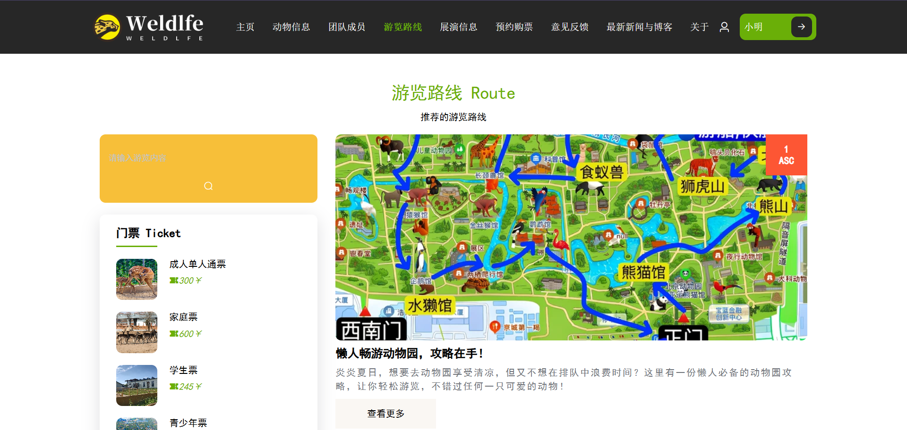

# 基于SpringBoot+Vue的智慧动物园管理系统的设计与实现

 **有不会的或者不懂的都可以QQ1760272627交流一下。** 
 
**系统演示视频** ：https://www.bilibili.com/video/BV1iFwzePE4x/?vd_source=5f273f72fd3dc593e25c33cbccdad12e

 **系统的二个主要模块：** 

**用户前台：** 

登录、注册、忘记密码、首页模块、查看动物信息、团队信息、查看游览路线及展演信息、预约与购票、意见建议反馈、新闻博客公告、个人中心、我的等功能

 **管理后台：** 

首页、员工管理、考勤管理、部门管理、角色管理、审核管理、动物管理、演出管理、园区管理、园区设施维修、饲养管理、行为观察管理、疫苗管理、看护管理、个人中心、票务管理、收入管理

 **系统截图：** 

 **采用技术：** SpringBoot，Mybatis-plus，shiro，Vue，redis，mysql，ElementUi 

 **工具：** idea，vscode，navicat

 **有不会的或者不懂的都可以QQ1760272627交流一下。** 
